# КТ

---

## KT1

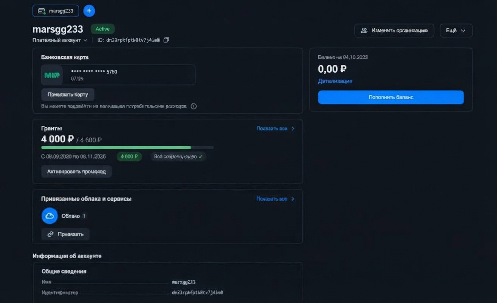

На этом скриншоте показано создание платежного аккаунта в Yandex Cloud, привязка банковской карты и успешное получение стартового гранта. Виден активный статус аккаунта и баланс

---

## KT2

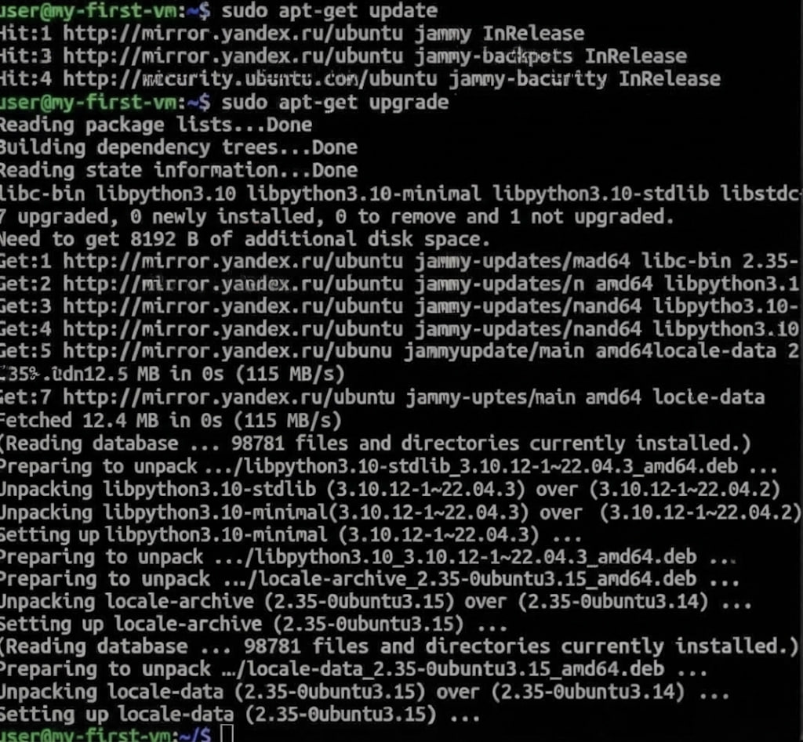

Здесь открыт дашборд консоли управления облаком. На экране отображается каталог по умолчанию (`default`) и основной интерфейс Compute Cloud для создания виртуальных машин

---

## KT3

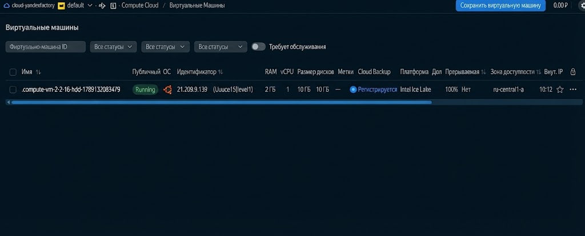

Здесь зафиксировано подключение к тестовой виртуальной машине по протоколу SSH. С помощью команд `sudo apt-get update` и `sudo apt-get upgrade` я обновил системные пакеты

---

## KT4

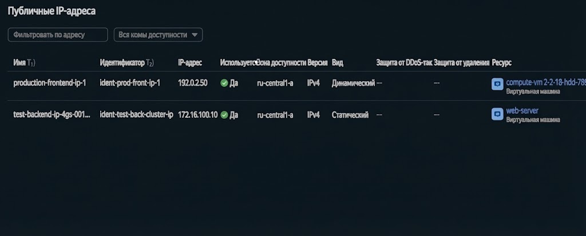

На скриншоте отображен список созданных виртуальных машин в Compute Cloud. Для каждой машины видны статус `Running`, IP-адреса и конфигурация дисков

---

## KT5

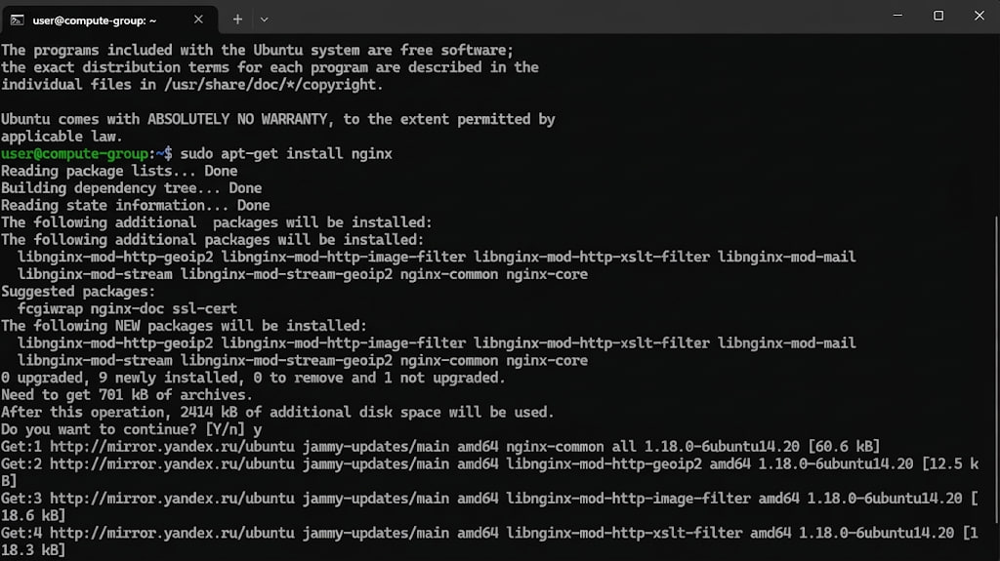

Здесь открыта страница управления публичными IP-адресами в Virtual Private Cloud. Показаны динамические и статические адреса, привязанные к ресурсам

---

## KT6

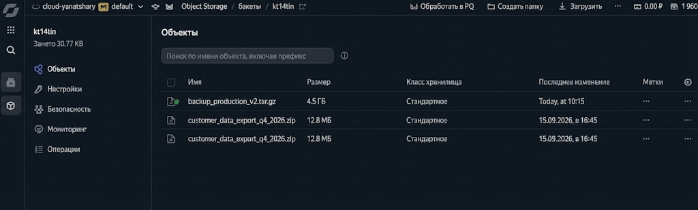

В терминале виртуальной машины я установил веб-сервер NGINX. На экране виден процесс установки и запросы подтверждения

---

## KT7

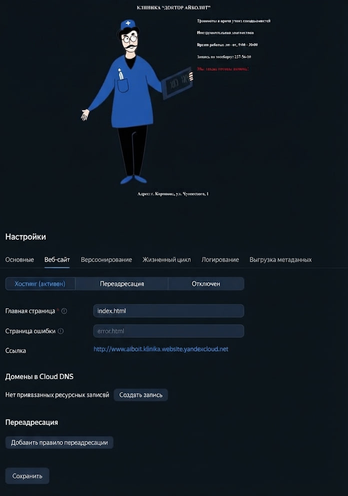

Здесь показан бакет в Yandex Object Storage с загруженными архивными и резервными файлами. Я проверил список объектов, их размер и класс хранения

---

## KT8

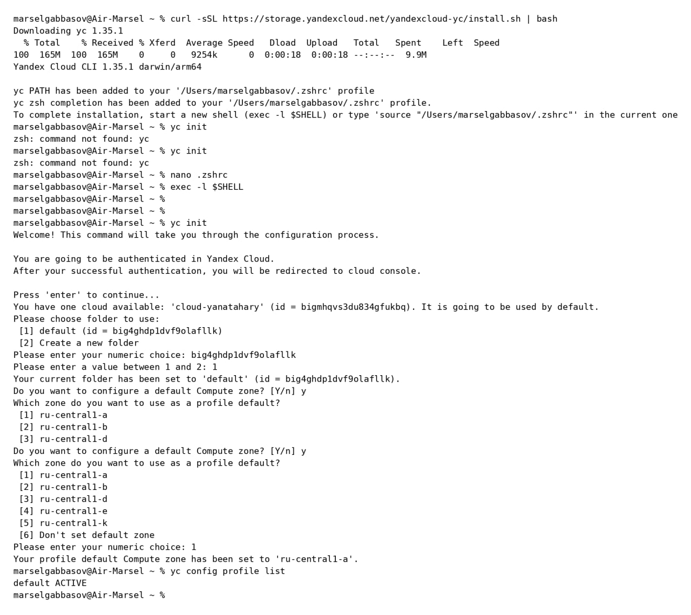

На этом шаге я настроил статическое веб-сайт хостирование для сайта клиники в Object Storage (`www.aiboit.healthcare`). Указал главные страницы и получил готовый публичный URL

---

## KT9

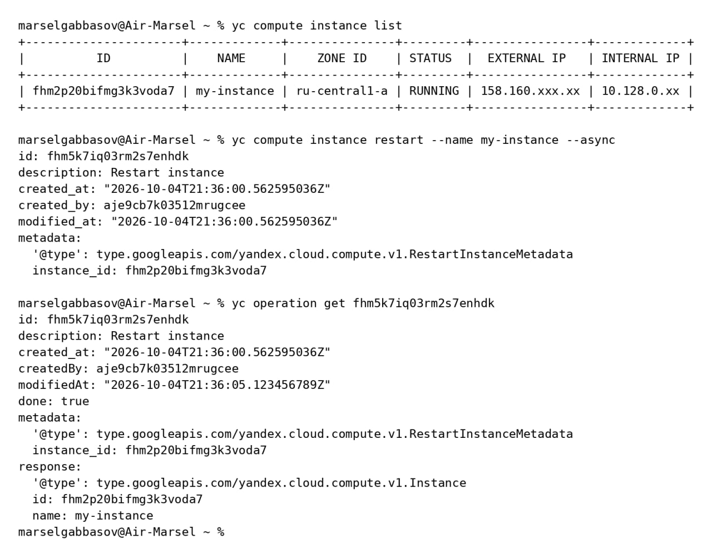

Сначала я установил и инициализировал консольную утилиту Yandex Cloud CLI (`yc init`) от имени пользователя `marselgabbasov@Air-Marsel`, выбрав облако, каталог и зону `ru-central1-a`

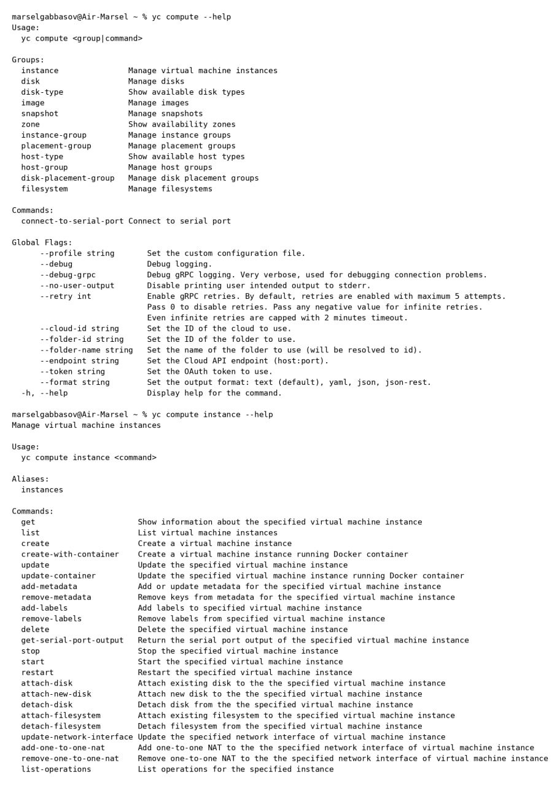

Затем с помощью CLI я вывел список машин (`yc compute instance list`), выполнил асинхронный перезапуск ВМ (`yc compute instance restart --name my-instance --async`) и проверил статус операции через `yc operation get`

---

## KT10

```text
+----------------------+-------------+---------------------+-------------------------+
|          ID          |    NAME     |      LABELS         | LAST AUTHENTICATED AT   |
+----------------------+-------------+---------------------+-------------------------+
| aje73cp51841okq9rs   | serviceuser |                     | 2020-09-18 08:03:54     |
| ajeacc2k31k86hi00g58 | user3       |                     | 2020-09-08 08:47:33     |
| ajetg513epfptsmtuva  | user2       |                     | 2020-09-08 08:46:10     |
+----------------------+-------------+---------------------+-------------------------+
```

Здесь выведен список учетных записей и сервисных аккаунтов в облаке с их идентификаторами и временем последней активности

```bash
marselgabbasov@Air-Marsel ~ % nano specification.yaml
marselgabbasov@Air-Marsel ~ % yc compute instance-group create --file specification.yaml
```

```text
WARNING: Cannot connect to YC tool initialization service. Network connectivity to the service is required for cli version control. In case you are using yc in an isolated environment, you may turn off this warning by setting env YC_CLI_INITIALIZATION_SILENCE=true
ERROR: rpc error: code = FailedPrecondition desc = Precondition failed:
- instance_template.network_interface_specs[0].network_id: Permission to use network <enptr3ifv2vbp62ttnmm6> denied
```

Я создал файл конфигурации `specification.yaml` для группы виртуальных машин, но при попытке запуска получил ошибку о нехватке прав на использование указанной сети

```bash
marselgabbasov@Air-Marsel ~ % yc resource-manager folder add-access-binding enptr3ifv2vbp62ttnmm6 \
--role vpc.user \
--subject serviceAccount:ajeacc2k31k86hi00g58
```

```text
ERROR: execute command: run command: folder with id or name "enptr3ifv2vbp62ttnmm6" not found
```

```bash
marselgabbasov@Air-Marsel ~ % yc resource-manager folder list
```

```text
+---------------------+---------+--------+
|         ID          |  NAME   | STATUS |
+---------------------+---------+--------+
| big4ghdpldv9olafllk | default | ACTIVE |
+---------------------+---------+--------+
```

Попытка выдать роль `vpc.user` сервисному аккаунту завершилась ошибкой из-за неверного ID ресурса, после чего я проверил список каталогов командой `yc resource-manager folder list`

```bash
marselgabbasov@Air-Marsel ~ % yc vpc subnet list
```

```text
+----------------------+----------------------+----------------------+--------------------+
|          ID          |         NAME         |      NETWORK ID      |       ZONE ID      |
+----------------------+----------------------+----------------------+--------------------+
| e9p7q8gqugidai8kscf  | yc-ru-central1-s     | enpnr4onfs6ihtoao32u | ru-central1-a      |
| ajop11jjce664fk66fr  | default-ru-central1-s| enpnr1z60g62ttnmmd   | ru-central1-a      |
| s21g7vs47o3bjnn8usl  | yc-ru-central1-b     | enpnr1z60g62ttnmmd   | ru-central1-b      |
| e2lmoac6s02ffj4z07  | default-ru-central1-c| enpnr1z60g62ttnmmd   | ru-central1-c      |
| v9b3no0lrqg16lnuxv97  | yc-ru-central1-s     | enpnr1z60g62ttnmmd   | ru-central1-d      |
| e9v5ubdch7kpkpburga  | my-subnet-3          | enptr3ifv2vbp62ttnmm6| ru-central1-d      |
| d9dsigq4qeanfin3sxc  | my-subnet-1          | enptr3ifv2vbp62ttnmmd| ru-central1-a      |
| e9p7q8gqugidai8kscf  | my-subnet-2          | enptr3ifv2vbp62ttnmmd| ru-central1-b      |
+----------------------+----------------------+----------------------+--------------------+
```

Я вывел список подсетей с помощью `yc vpc subnet list`, чтобы узнать точные идентификаторы для правильного заполнения спецификации

```bash
marselgabbasov@Air-Marsel ~ % yc resource-manager folder add-access-binding algl4phdip9dvf9ollvk \
--role editor \
--subject serviceAccount:ajeacc2k31k86hi00g58
```

```text
done (1s)
```

```bash
marselgabbasov@Air-Marsel ~ % yc compute instance-group create --file specification.yaml
```

```text
done (1ms)
id: cl1r5iv1jvhhxvengvf
name: my-group
status: ACTIVE
size: 3
```

После назначения правильной роли `editor` сервисному аккаунту я повторно запустил создание группы, и она успешно перешла в статус `ACTIVE`

```bash
marselgabbasov@Air-Marsel ~ % yc load-balancer network-load-balancer create \
--name my-load-balancer \
--listener name=my-listener,external-ip-version=ipv4,port=80 \
--target-group target-group-id=enptbmmsaqsu61dnl47g,healthcheck-name=hc,healthcheck-interval=2,healthcheck-timeout=1,healthcheck-unhealthythreshold=2,healthcheck-healthythreshold=2,healthcheck-http-port=80
```

```bash
marselgabbasov@Air-Marsel ~ % yc load-balancer network-load-balancer target-states my-load-balancer \
--target-group-id enptbmmsaqsu61dnl47g
```

```text
+---------------------+-------------------+---------+
|       SUBNET ID     |      ADDRESS      | STATUS  |
+---------------------+-------------------+---------+
| e9p7q8gqugidai8kscf | 192.168.1.18      | HEALTHY |
| v9b3no0lrqg16lnuxv97| 192.168.2.28      | HEALTHY |
| e9v5ubdch7kpkpburga | 192.168.3.36      | HEALTHY |
+---------------------+-------------------+---------+
```

Я создал сетевой балансировщик нагрузки с обработчиком и проверкой здоровья, после чего проверил состояние целевой группы — все машины имеют статус `HEALTHY`

```bash
marselgabbasov@Air-Marsel ~ % yc compute instance list --folder-id standard-images | grep ubuntu-2004-lts
```

```text
fd8fost9medktbjccp92  ubuntu-2004-lts-x188       ... | READY
fd8fokslv9rok3upjp9j  ubuntu-2004-lts-oslogin    ... | READY
```

```bash
marselgabbasov@Air-Marsel ~ % yc compute instance-group delete my-group
```

```text
You are going to be authenticated via subject-id 'aje7880etobk17dj1vg'. Authentication web site will be opened...
Done (1m47s)
```

Здесь я проверил доступные образы Ubuntu 20.04 для обновления группы, а затем удалил созданную группу ВМ командой `yc compute instance-group delete`

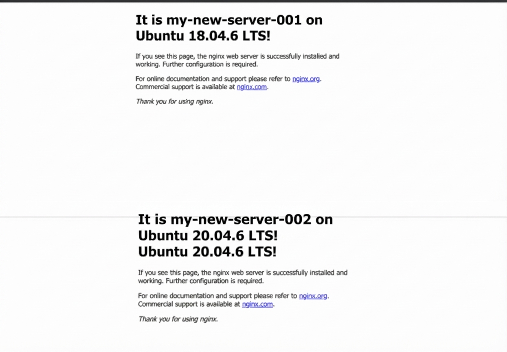

На скриншоте видно приветственные страницы веб-сервера NGINX с именами экземпляров `my-new-server-001` на Ubuntu 18.04.6 LTS и `my-new-server-002` на Ubuntu 20.04.6 LTS, что подтверждает успешную работу балансировщика нагрузки

```yaml
allocation_policy:
  zones:
    - zone_id: ru-central1-a
load_balancer_state:
  target_group_id: enptbmnsaqsu61dn147g
managed_instances_state:
  target_size: "3"
load_balancer_spec:
  target_group_spec:
    name: my-target-group
service_account_id: ajeacc2k31k86hi00g58
status: ACTIVE
application_load_balancer_state: {}
```

Здесь показано состояние созданной группы: зона доступности `ru-central1-a`, целевая группа балансировщика `enptbmnsaqsu61dn147g`, целевой размер группы 3 и статус `ACTIVE`

---

## KT11

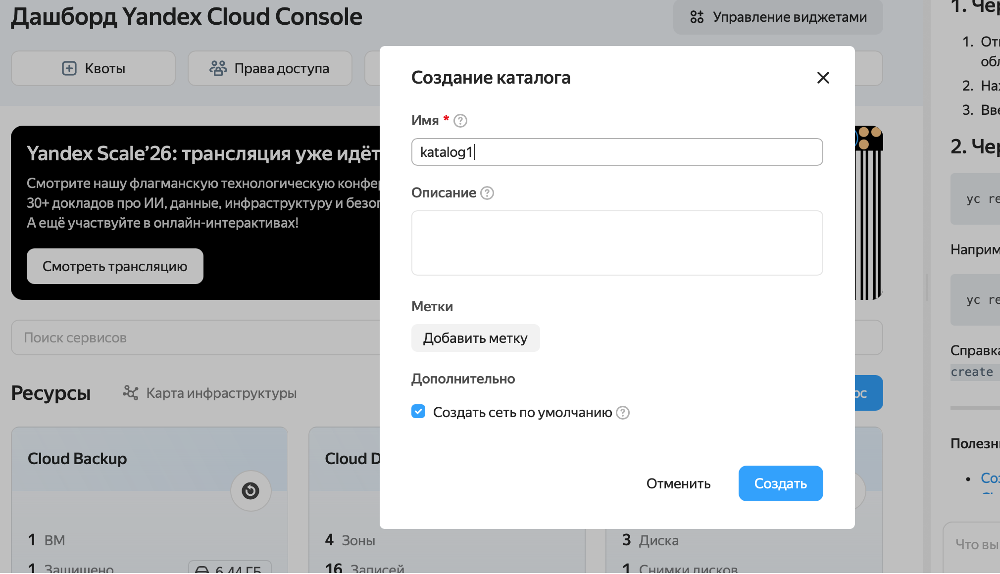

На этом скриншоте показано создание нового каталога (`katalog1`) в консоли Yandex Cloud с включенной опцией создания сети по умолчанию

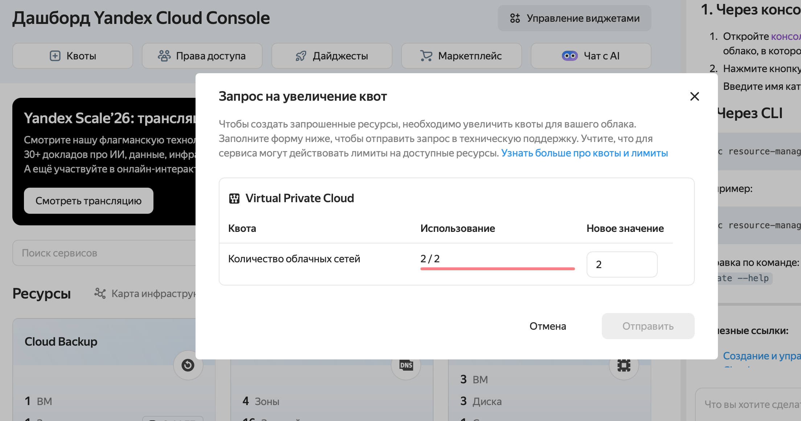

Здесь отображается диалог запроса на увеличение сетевых квот в Virtual Private Cloud (лимит сетей 2/2), что необходимо для дальнейшего расширения инфраструктуры

